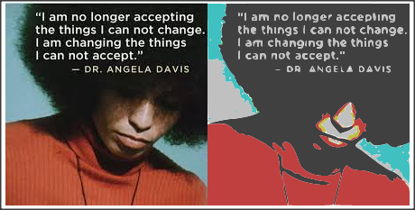

# img2svg

Vectorize Image Data to SVG using potrace algorithm v.1.16 with color

**version 1.0.0** (18 kB minified)

**demo in nodejs with `CanvasLite`:**

```js
const CanvasLite = require('./CanvasLite.js');
const img2svg = require('../build/img2svg.js');
const img = new CanvasLite.Image(), canvas = new CanvasLite();
img.onload = () => {
    canvas.width = img.width;
    canvas.height = img.height;
    canvas.getContext('2d').drawImage(img, 0, 0);
    const imgData = canvas.getContext('2d').getImageData(0, 0, img.width, img.height);
    console.log(img2svg(imgData, {mode:"color",depth:5,turdsize:0,minpathsegments:2}));
};
img.src = __dirname + '/test.jpeg';
```

**demo in browser:**

```js
function el(html)
{
    const container = document.createElement('div');
    container.innerHTML = html;
    return container.firstChild;
}
const img = new Image(), canvas = document.createElement('canvas');
img.onload = () => {
    canvas.width = img.width;
    canvas.height = img.height;
    canvas.getContext('2d').drawImage(img, 0, 0);
    const imgData = canvas.getContext('2d').getImageData(0, 0, img.width, img.height);
    const svg = img2svg(imgData, {mode:"color",depth:5,turdsize:0,minpathsegments:2});
    document.body.appendChild(img);
    document.body.appendChild(el(svg));
};
img.src = './test.jpeg';
```

**Result:**




**Options:**

* `mode`: "hue" | "gray" (for grayscale images) | "color" (default)
* `depth`: depth of color quantization (default 2)
* `depthR`,`depthG`,`depthB`,`depthA`: depth per separate image channel (default `depth`)

**POTRACE Options:**

* `connectedcomponents`: (separate disconnected paths) true (default)
* `minpathsegments`: (minimum number of path points) 2 (default)
* `turnpolicy`: "left" | "right" | "black" | "white" | "majority" | "minority" (default)
* `turdsize`: (minimum area to trace) 2 (default)
* `alphamax`: (balance between more curves vs more corners) 1 (default)
* `optcurve`: (generate optimum curves) true (default)
* `opttolerance`: (tolerance for optimum curves) 0.2 (default)

