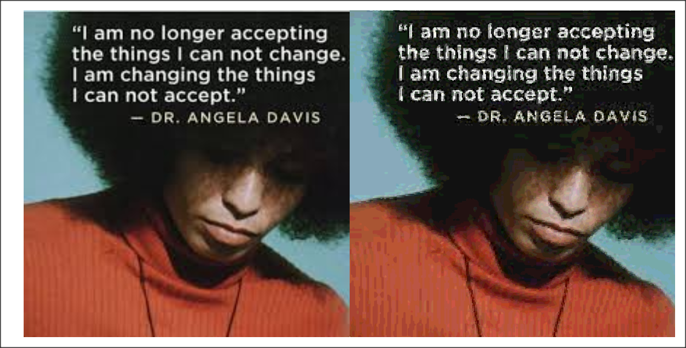

# img2svg

Vectorize Image Data to SVG using potrace algorithm v.1.16 with color

**version 1.0.0** (15 kB minified)

**demo in nodejs with `CanvasLite`:**

```js
const CanvasLite = require('./CanvasLite.js');
const img2svg = require('../build/img2svg.js');
const img = new CanvasLite.Image();
img.onload = () => {
    const canvas = new CanvasLite(img.width, img.height);
    canvas.getContext('2d').drawImage(img, 0, 0);
    const imgData = canvas.getContext('2d').getImageData(0, 0, img.width, img.height);
    console.log(img2svg(imgData, {depth:2}));
};
img.src = __dirname + '/test.jpeg';
```

**demo in browser:**

```js
function el(html)
{
    const container = document.createElement('div');
    container.innerHTML = html;
    return container.firstChild;
}
const img = new Image(), canvas = document.createElement('canvas');
img.onload = () => {
    canvas.width = img.width;
    canvas.height = img.height;
    canvas.getContext('2d').drawImage(img, 0, 0);
    const imgData = canvas.getContext('2d').getImageData(0, 0, img.width, img.height);
    const svg = img2svg(imgData, {depth:2});
    document.body.appendChild(img);
    document.body.appendChild(el(svg));
};
img.src = './test.jpeg';
```

**Result:**


